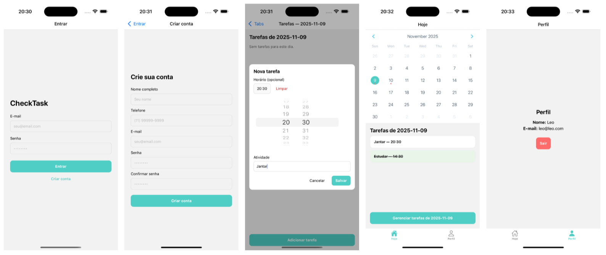

# ✅ Check Task

**Check Task** é um aplicativo mobile desenvolvido com **React Native (Expo)** e **Node.js**, criado para ajudar usuários a **organizar e acompanhar suas tarefas diárias** de forma prática, visual e segura.




## 📱 Sobre o Projeto

O **Check Task** tem como objetivo fornecer uma interface simples e intuitiva para gerenciamento de tarefas, com suporte a:
- Cadastro e login de usuários;
- Exibição de tarefas no formato de **calendário**;
- **Checklists** de atividades diárias;
- Criação, edição e exclusão de tarefas;
- Armazenamento local com **SQLite**.

Este projeto foi desenvolvido como parte da disciplina **Desenvolvimento de Aplicativos Mobile** do Curso de **Ciência da Computação da PUC-SP**.


## 🚀 Funcionalidades

| Categoria | Descrição |
|------------|------------|
| 🗓️ **Calendário Integrado** | Exibe as tarefas do dia com horários e status. |
| ✏️ **Gerenciamento de Tarefas** | Criação, edição e exclusão de atividades. |
| ✅ **Checklist Diário** | Permite marcar tarefas como concluídas. |
| ⚙️ **Persistência Local** | Armazenamento de dados com `SQLite`. |


## 🧠 Regras de Negócio

- O usuário **deve estar logado** para acessar as tarefas;
- O **cadastro exige nome, e-mail, telefone e senha** válidos;
- As senhas são **criptografadas com bcrypt** antes de serem salvas;
- Cada tarefa possui **título, horário e status**;
- O usuário pode **criar, editar, marcar e excluir tarefas** livremente;
- Os dados são **armazenados localmente**, podendo futuramente ser sincronizados com a nuvem.


## 🧩 Arquitetura e Tecnologias

### **Stack Principal**
- **Frontend:** React Native + Expo  
- **Backend:** Node.js + Express  
- **Banco de Dados:** SQLite  
- **Design e Prototipação:** Figma  

### **Fluxo Geral**
1. O usuário interage com o app mobile (React Native);
2. O backend Node.js processa autenticações e lógica de negócio;
3. O SQLite realiza o armazenamento local das tarefas;

## 🧰 Dependências Principais

### Mobile (React Native)
```bash
expo install expo-sqlite react-native-calendars @react-native-community/checkbox
npm install bcryptjs axios

Backend (Node.js)

npm install express bcrypt sqlite3 cors
```

## 🧭 Próximas Etapas
* Finalizar integração entre frontend e backend
* Implementar notificações e lembretes
* Adicionar suporte à sincronização em nuvem (Firebase)
* Criar dashboard de produtividade semanal
* Publicar na Google Play Store

## 👨‍💻 Autores
* [Leonardo Fajardo Grupioni](https://www.linkedin.com/in/leonardo-grupioni/)
* [Julia Gachdio Schmidt](https://www.linkedin.com/in/julia-gachido-schmidt/)
